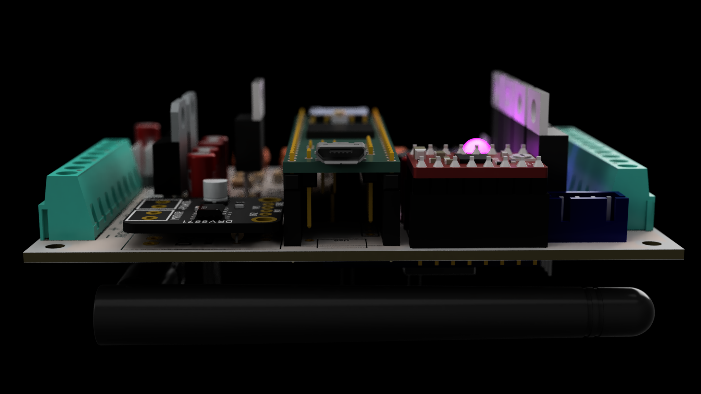
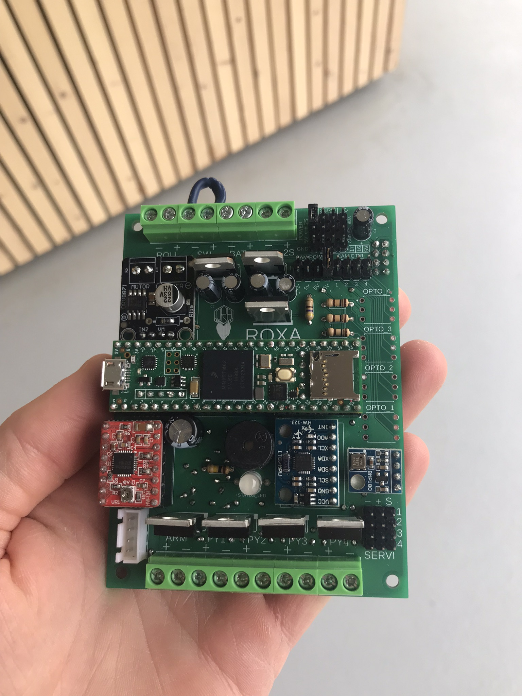

RoXA stands for Rocket experimental avionics. It's my first flight computer (that is more than an arduino with a barometer soldered : ), you can see in [this instructables](https://www.instructables.com/Rocket-Flight-Computer/) a more detailed description of the design and build.

In this repo you'll find the PCB design and manufacturing files, as well as the code. For now it can reliably trigger first and second events. I'm working actively on this project to add reliable data logging and telemetry (and many other things...).

Keywords : Flight computer avionics Rocket Reaction wheel Rogallo
